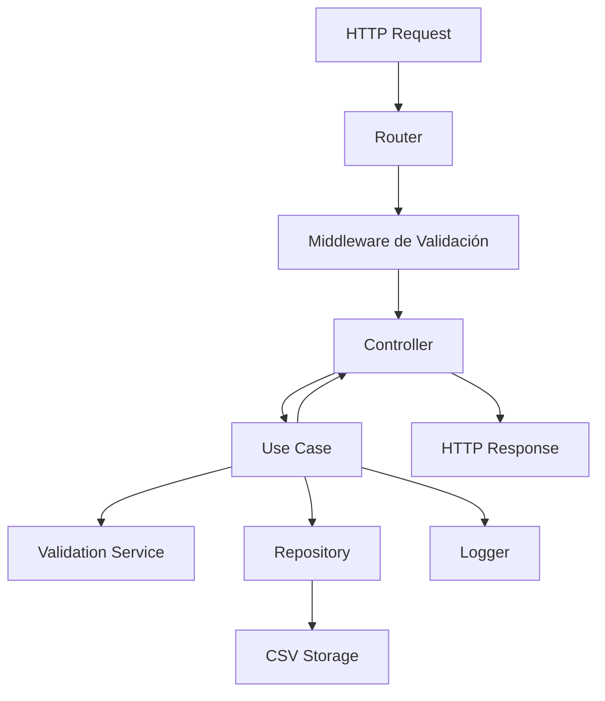
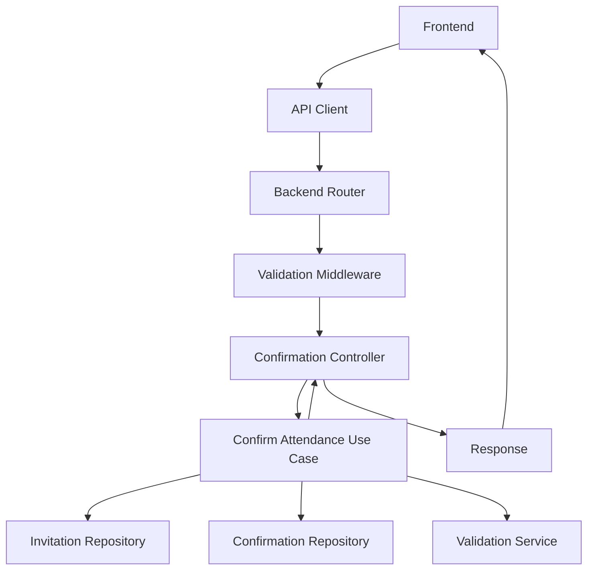

# Arquitectura del Sistema - Wedding Invitation

## 📋 Resumen Ejecutivo

Este documento describe la arquitectura completa del sistema de invitaciones de boda, que ha sido refactorizado siguiendo los principios de **Clean Architecture** y **SOLID** para garantizar mantenibilidad, escalabilidad y testabilidad.

## 🏗️ Arquitectura General

### Principios Arquitectónicos

1. **Clean Architecture**: Separación clara de responsabilidades en capas
2. **SOLID Principles**: Diseño orientado a objetos robusto
3. **Dependency Injection**: Inversión de dependencias para flexibilidad
4. **Domain-Driven Design**: Modelado centrado en el dominio de negocio
5. **Test-Driven Development**: Cobertura de tests unitarios

### Estructura del Proyecto

```
Invitacion-boda/
├── frontend/
│   ├── invitation/          # Frontend de invitaciones (renombrado de public)
│   │   ├── index.html
│   │   ├── styles.css
│   │   └── js/             # Arquitectura Clean en frontend
│   │       ├── core/       # Entidades y servicios de dominio
│   │       ├── infrastructure/ # Adaptadores externos
│   │       └── presentation/   # Controladores y vistas
│   └── admin/              # Panel administrativo
│       ├── index.html
│       ├── admin.js
│       └── css/
├── backend/                # Backend con Clean Architecture ✅ IMPLEMENTADA
│   ├── src/
│   │   ├── core/          # Capa de Dominio ✅
│   │   │   ├── entities/     → Invitation.js, Confirmation.js
│   │   │   ├── repositories/ → IInvitationRepository.js, IConfirmationRepository.js
│   │   │   ├── services/     → Servicios de dominio
│   │   │   └── exceptions/   → Excepciones de negocio
│   │   ├── application/   # Capa de Aplicación ✅
│   │   │   ├── usecases/     → CreateInvitationUseCase.js, ConfirmAttendanceUseCase.js
│   │   │   ├── dto/          → Data Transfer Objects
│   │   │   └── services/     → Servicios de aplicación
│   │   ├── infrastructure/ # Capa de Infraestructura ✅
│   │   │   ├── repositories/ → CsvInvitationRepository.js, CsvConfirmationRepository.js
│   │   │   ├── services/     → CsvStorage.js
│   │   │   ├── middleware/   → Middleware de seguridad
│   │   │   ├── external/     → Servicios externos
│   │   │   └── storage/      → Almacenamiento
│   │   ├── presentation/  # Capa de Presentación ✅
│   │   │   ├── controllers/  → InvitationController.js, ConfirmationController.js
│   │   │   ├── routes/       → Configuración de rutas
│   │   │   ├── middleware/   → authMiddleware.js, securityMiddleware.js
│   │   │   └── serializers/  → Serialización de respuestas
│   │   ├── shared/        # Servicios compartidos ✅
│   │   │   ├── utils/        → Logger.js, ValidationService.js, DIContainer.js
│   │   │   ├── constants/    → Constantes globales
│   │   │   ├── container/    → Dependency Injection
│   │   │   └── exceptions/   → Excepciones compartidas
│   │   └── tests/         # Tests unitarios ✅
│   │       ├── unit/         → Tests de entidades y casos de uso
│   │       ├── integration/  → Tests de integración
│   │       └── e2e/          → Tests end-to-end
│   ├── jest.config.js     # Configuración de testing ✅
│   ├── package.json
│   └── README.md
├── data/                  # Archivos de datos CSV
├── docs/                  # Documentación del proyecto
└── README.md
```

## 🎯 Backend - Clean Architecture

### Capa de Dominio (Core)

**Responsabilidad**: Contiene la lógica de negocio pura, independiente de frameworks y tecnologías externas.

#### Entidades

```javascript
// core/entities/Invitation.js
class Invitation {
    constructor(data) {
        this.validateData(data);
        // Lógica de negocio pura
    }
    
    confirm(confirmationData) {
        // Reglas de negocio para confirmación
    }
    
    cancel(reason, cancelledBy) {
        // Reglas de negocio para cancelación
    }
}

// core/entities/Confirmation.js
class Confirmation {
    constructor(data) {
        this.validateData(data);
        // Lógica de confirmación
    }
}
```

#### Interfaces de Repositorios

```javascript
// core/repositories/IInvitationRepository.js
class IInvitationRepository {
    async save(invitation) { throw new Error('Not implemented'); }
    async findByCode(code) { throw new Error('Not implemented'); }
    async findAll(filters) { throw new Error('Not implemented'); }
    // ... más métodos
}
```

### Capa de Aplicación

**Responsabilidad**: Orquesta las operaciones de negocio y coordina entre entidades.

#### Casos de Uso

```javascript
// application/usecases/CreateInvitationUseCase.js
class CreateInvitationUseCase {
    constructor(invitationRepository, validationService, logger) {
        this.invitationRepository = invitationRepository;
        this.validationService = validationService;
        this.logger = logger;
    }
    
    async execute(invitationData) {
        // 1. Validar datos
        // 2. Crear entidad
        // 3. Generar código único
        // 4. Persistir
        // 5. Retornar resultado
    }
}
```

### Capa de Infraestructura

**Responsabilidad**: Implementa las interfaces definidas en el dominio usando tecnologías específicas.

#### Repositorios

```javascript
// infrastructure/repositories/CsvInvitationRepository.js
class CsvInvitationRepository extends IInvitationRepository {
    constructor(csvStorage, logger) {
        super();
        this.csvStorage = csvStorage;
        this.logger = logger;
    }
    
    async save(invitation) {
        // Implementación específica para CSV
    }
}
```

#### Servicios

```javascript
// infrastructure/services/ValidationService.js
class ValidationService {
    validateInvitationData(data) {
        // Validaciones específicas
    }
    
    generateInvitationCode() {
        // Generación de códigos únicos
    }
}
```

### Capa de Presentación

**Responsabilidad**: Maneja la comunicación HTTP y coordina las respuestas.

#### Controladores

```javascript
// presentation/controllers/InvitationController.js
class InvitationController {
    constructor(createInvitationUseCase, getInvitationUseCase, logger) {
        this.createInvitationUseCase = createInvitationUseCase;
        this.getInvitationUseCase = getInvitationUseCase;
        this.logger = logger;
    }
    
    async createInvitation(req, res) {
        // 1. Extraer datos del request
        // 2. Ejecutar caso de uso
        // 3. Formatear respuesta
    }
}
```

#### Rutas

```javascript
// presentation/routes/invitationRoutes.js
function configureInvitationRoutes(invitationController, middleware) {
    const router = express.Router();
    
    // Rutas públicas
    router.get('/:code', 
        middleware.validateParams,
        invitationController.getInvitation.bind(invitationController)
    );
    
    // Rutas administrativas
    router.use(middleware.authenticate);
    router.post('/', 
        middleware.validateBody,
        invitationController.createInvitation.bind(invitationController)
    );
    
    return router;
}
```

#### Middleware

```javascript
// presentation/middleware/securityMiddleware.js
class SecurityMiddleware {
    get rateLimit() {
        return rateLimit({
            windowMs: 15 * 60 * 1000,
            max: 100
        });
    }
    
    get validateParams() {
        return (req, res, next) => {
            // Validación de parámetros
        };
    }
}
```

## 🎨 Frontend - Arquitectura Limpia

### Estructura Organizada

```
frontend/invitation/js/
├── core/                   # Capa de Dominio
│   ├── models/            # Modelos de datos
│   └── services/          # Servicios de dominio
├── infrastructure/        # Capa de Infraestructura
│   ├── api/              # Clientes API
│   ├── storage/          # Almacenamiento local
│   └── external/         # Servicios externos
├── presentation/          # Capa de Presentación
│   ├── controllers/      # Controladores de vista
│   ├── components/       # Componentes UI
│   └── views/           # Vistas
├── shared/               # Código compartido
│   ├── utils/           # Utilidades
│   ├── constants/       # Constantes
│   └── helpers/         # Helpers
└── config/              # Configuración
    ├── app-config.js
    ├── dependencies.js
    └── di-container.js
```

### Dependency Injection

```javascript
// config/di-container.js
class DIContainer {
    constructor() {
        this.dependencies = new Map();
        this.singletons = new Map();
    }
    
    register(name, factory, options = {}) {
        this.dependencies.set(name, { factory, options });
    }
    
    resolve(name) {
        // Resolución de dependencias
    }
}
```

## 🔧 Patrones de Diseño Implementados

### 1. Repository Pattern
- Abstrae el acceso a datos
- Permite cambiar implementaciones sin afectar la lógica de negocio

### 2. Use Case Pattern
- Encapsula la lógica de aplicación
- Facilita testing y reutilización

### 3. Dependency Injection
- Inversión de control
- Facilita testing con mocks

### 4. Factory Pattern
- Creación de objetos complejos
- Centraliza la lógica de construcción

### 5. Observer Pattern
- Comunicación entre componentes
- Desacoplamiento de eventos

### 6. Strategy Pattern
- Algoritmos intercambiables
- Flexibilidad en validaciones

## 🛡️ Seguridad

### Medidas Implementadas

1. **Autenticación y Autorización**
   - JWT tokens para sesiones
   - Basic Auth para compatibilidad
   - Middleware de autenticación

2. **Validación y Sanitización**
   - Validación de entrada en todas las capas
   - Sanitización contra XSS
   - Validación de tipos de datos

3. **Rate Limiting**
   - Protección contra ataques de fuerza bruta
   - Límites diferenciados por endpoint

4. **Headers de Seguridad**
   - Helmet.js para headers HTTP seguros
   - CORS configurado apropiadamente
   - CSP (Content Security Policy)

5. **Logging y Monitoreo**
   - Logs estructurados
   - Tracking de requests
   - Detección de anomalías

## 🧪 Testing

### Estrategia de Testing

1. **Tests Unitarios**
   - Cobertura mínima del 70%
   - Tests para entidades, casos de uso y servicios
   - Mocking de dependencias externas

2. **Tests de Integración**
   - Pruebas de endpoints completos
   - Validación de flujos de datos

3. **Tests de Contrato**
   - Validación de interfaces
   - Compatibilidad entre capas

### Configuración

```javascript
// jest.config.js
module.exports = {
    testEnvironment: 'node',
    collectCoverage: true,
    coverageThreshold: {
        global: {
            branches: 70,
            functions: 70,
            lines: 70,
            statements: 70
        }
    }
};
```

## 📊 Monitoreo y Observabilidad

### Logging Estructurado

```javascript
// shared/utils/Logger.js
class Logger {
    info(message, metadata = {}) {
        console.log(JSON.stringify({
            level: 'info',
            message,
            timestamp: new Date().toISOString(),
            ...metadata
        }));
    }
    
    startOperation(operation, metadata = {}) {
        const startTime = Date.now();
        return (result = {}, level = 'info') => {
            this[level](`Operation completed: ${operation}`, {
                ...metadata,
                ...result,
                duration: Date.now() - startTime
            });
        };
    }
}
```

### Métricas

- Tiempo de respuesta de endpoints
- Tasa de errores
- Número de invitaciones creadas
- Tasa de confirmación
- Uso de recursos

## 🚀 Escalabilidad

### Consideraciones de Diseño

1. **Separación de Responsabilidades**
   - Cada capa tiene una responsabilidad específica
   - Facilita el escalado horizontal

2. **Interfaces Bien Definidas**
   - Contratos claros entre capas
   - Permite reemplazar implementaciones

3. **Configuración Externalizada**
   - Variables de entorno
   - Configuración por ambiente

4. **Stateless Design**
   - No estado en el servidor
   - Facilita la replicación

## 🔄 Flujo de Datos

### Creación de Invitación



### Confirmación de Asistencia



## 📈 Métricas de Calidad

### Código

- **Complejidad Ciclomática**: < 10 por función
- **Cobertura de Tests**: > 70%
- **Duplicación de Código**: < 5%
- **Deuda Técnica**: Monitoreada y controlada

### Performance

- **Tiempo de Respuesta**: < 200ms para operaciones simples
- **Throughput**: > 100 requests/segundo
- **Disponibilidad**: > 99.9%

## 🔮 Roadmap Técnico

### Próximas Mejoras

1. **Base de Datos**
   - Migración de CSV a base de datos relacional
   - Implementación de Repository para SQL

2. **Caching**
   - Redis para cache de sesiones
   - Cache de consultas frecuentes

3. **Microservicios**
   - Separación en servicios independientes
   - API Gateway

4. **Containerización**
   - Docker para desarrollo y producción
   - Kubernetes para orquestación

5. **CI/CD**
   - Pipeline automatizado
   - Despliegue continuo

## 📚 Referencias

- [Clean Architecture - Robert C. Martin](https://blog.cleancoder.com/uncle-bob/2012/08/13/the-clean-architecture.html)
- [SOLID Principles](https://en.wikipedia.org/wiki/SOLID)
- [Domain-Driven Design](https://martinfowler.com/bliki/DomainDrivenDesign.html)
- [Dependency Injection](https://martinfowler.com/articles/injection.html)

---

**Última actualización**: Enero 2026  
**Versión**: 2.0  
**Autor**: Equipo de Desarrollo

---- TODO
Cosas por revisar
Refinar bien el filtrado y el popup
El boton de importar csv, no aparece el archivo cuando se carga
Revisar el modal de creacion de invitaciones
revisar el funcionamiento de modal detalles en invitaciones
afinar la talba de invitaciones
dejar de usar metodo de csv y pasarnos a base de datos

-----

cosas por meter

una opcion nueva de configuraciones donde se pueda configurar visualmente el archivo config.js dinamicamente desde el dashboard
